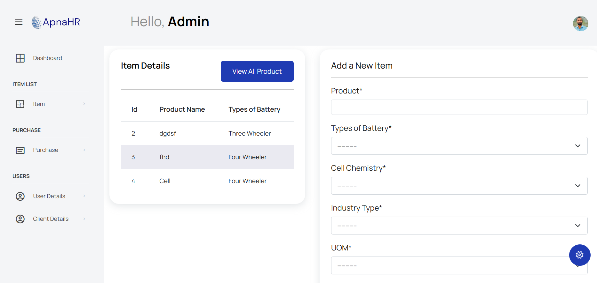
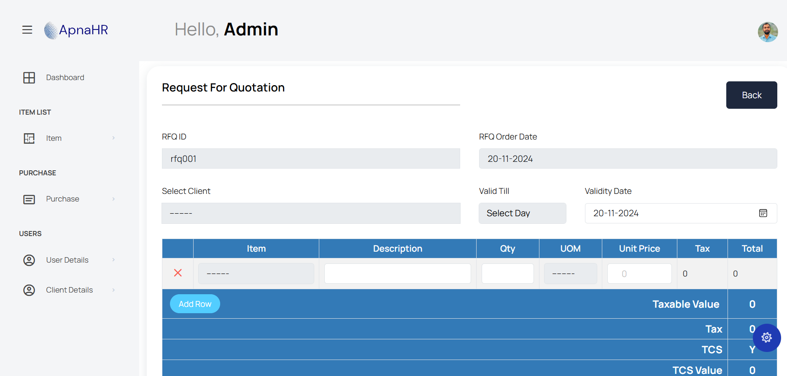
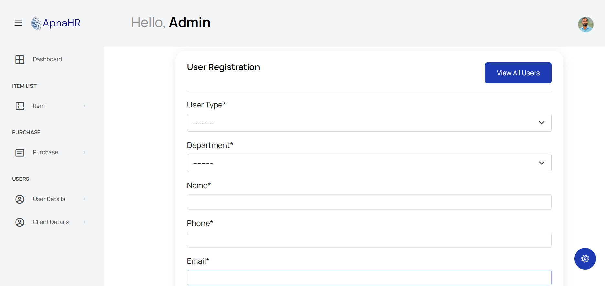
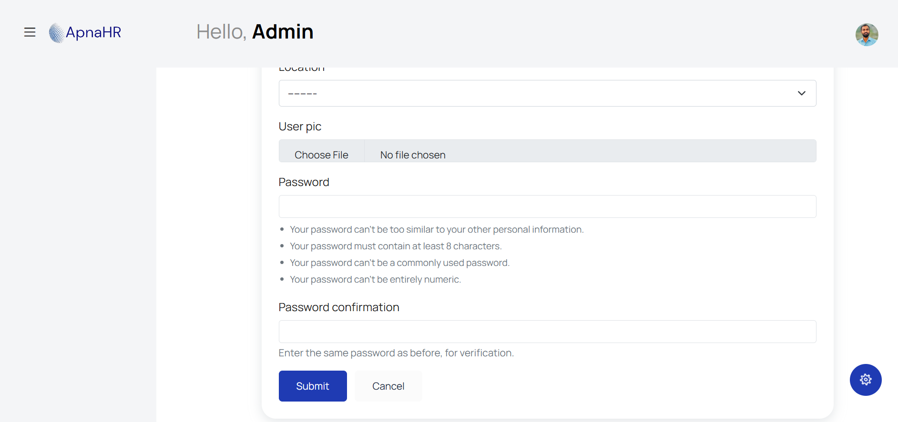
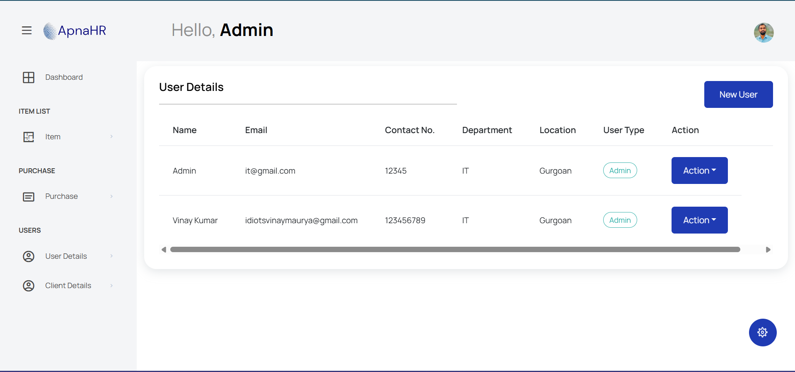
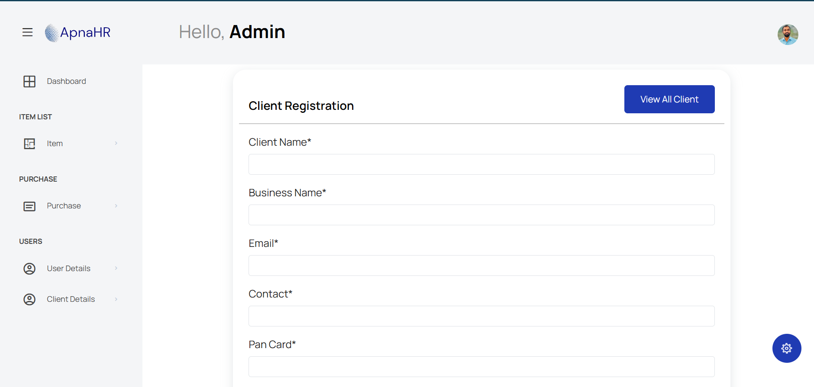
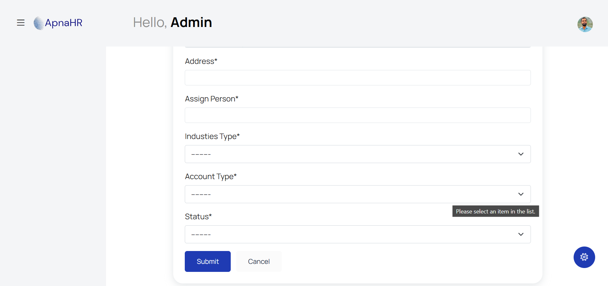
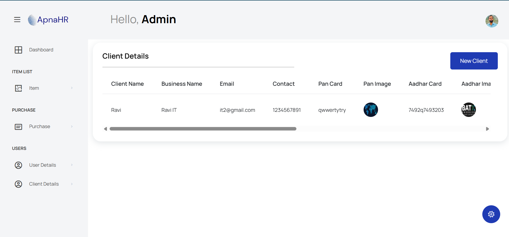
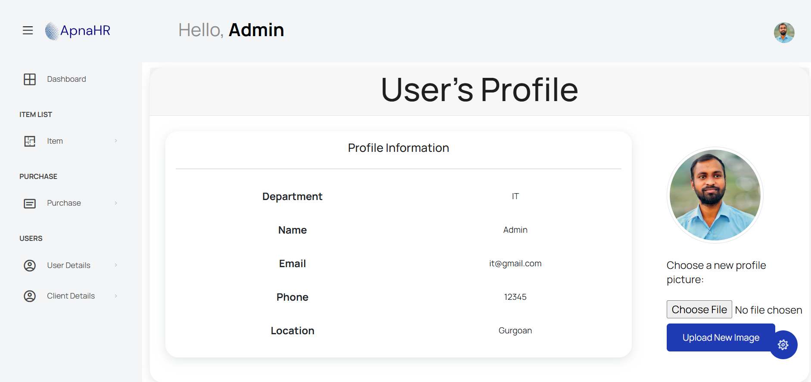
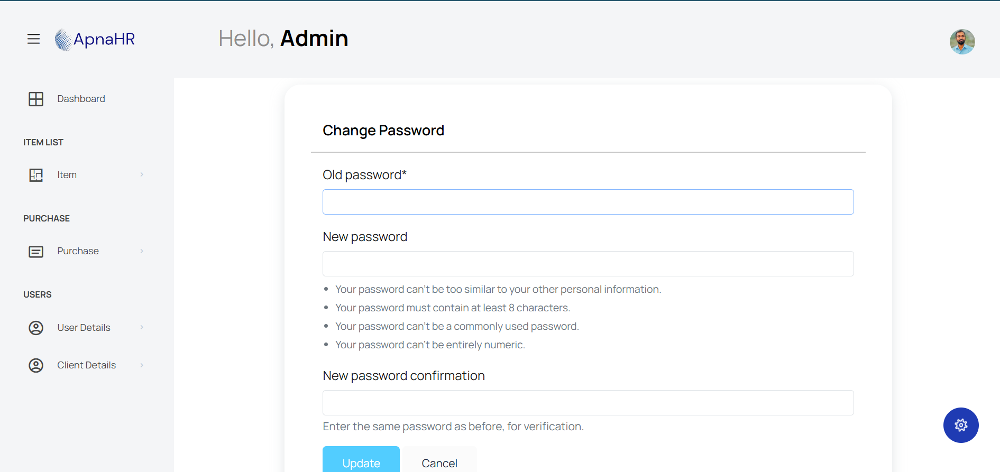

This is Project which help to track inventory.

This project made on Django Framework where i use other language also like Python, HTML, CSS and Javascript.

In This project you can track inventory.

This project also the feature to manage employee who will see and work on which inventory part.

Normal Employee will only add inventory add view the inventory.

Admin Employee will add employee and revome employee and also remove inventory and view all inventory.

You can login with ID - it@gmail.com pass- 1234

